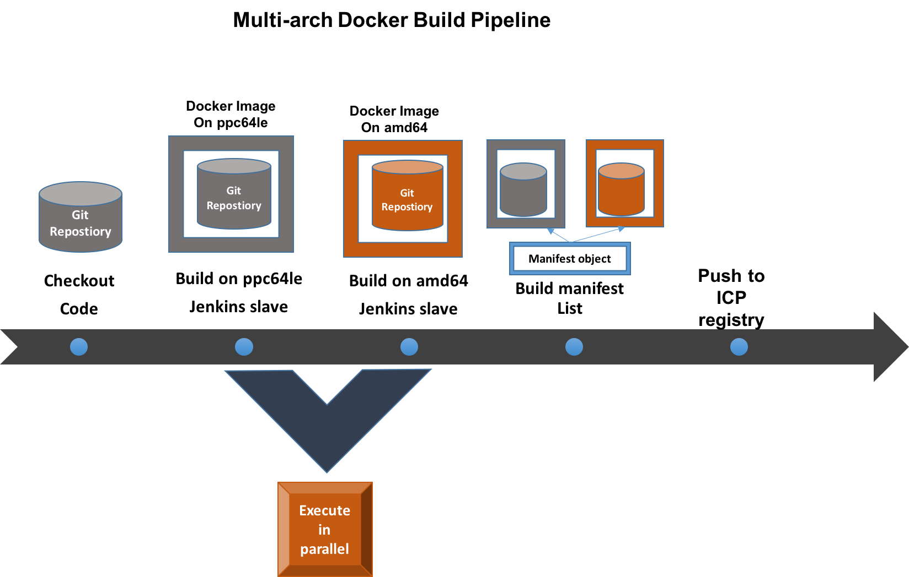
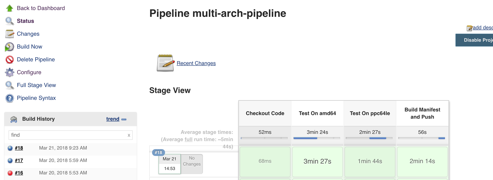

# Jenkins multi-arch pipeline

This repository hosts code to do multi-arch CI/CD build pipeline using Jenkins.
We have done this Proof of Concept using two arch types namely - `amd64` and `ppc64le`. Unless otherwise specified, the multi-arch definition would mean these two architectures only.

### Flow diagram

### Approach 1 - Using DooD - Docker outside of Docker

In this approach, we run the docker daemon outside the jenkins slave. In order to do this, we can't use the jenkins slave as is since we have limitations w.r.t non-availability of the docker client binary in the image. Adding the docker client also means that we need to run the image as a `root` user inside the container instead of the `jenkins` user.

You can take the DooD approach in the following way:

1. Clone this repository.

2. Build and install the manifest tool from here: https://github.com/estesp/manifest-tool/. Alternatively please follow the instructions mentioned here to use manifest - https://docs.docker.com/edge/engine/reference/commandline/manifest/

   Note: Login to the ICP registry before pushing the images in the next step: `docker login mycluster.icp:8500`

3. Build the jenkins slaves for both architecture types.
  - cd jenkins-slave-base
  - Build slave base for ppc64le: `docker build -t mycluster.icp:8500/default/jenkins-slave-ppc64le -f Dockerfile.ppc64le .`
  - Push the image to ICP registry: `docker push mycluster.icp:8500/default/jenkins-slave-ppc64le`
  - Build slave base for amd64:   `docker build -t mycluster.icp:8500/default/jenkins-slave-amd64 -f Dockerfile .`
  - Push the image to ICP registry: `docker push mycluster.icp:8500/default/jenkins-slave-amd64`
  - Build manifest and push: `manifest-tool --username admin --password admin push from-spec manifest-yaml-slave-base.yaml`
  This would make the slave base image available in ICP registry.
  
4. Build the jnlp slave with manifest-tool.
  - cd jenkins-slave/jenkins-jnlp-slave-amd64
  - Build jnlp slave for ppc64le: `docker build -t mycluster.icp:8500/default/slave-jnlp-amd64 .`
  - Push the image to ICP registry: `docker push mycluster.icp:8500/default/slave-jnlp-amd64`
  - cd ../jenkins-jnlp-slave-ppc64le
  - Build jnlp slave for ppc64le:   `docker build -t mycluster.icp:8500/default/slave-jnlp-ppc64le -f Dockerfile.ppc64le .`
  - Push the image to ICP registry: `docker push mycluster.icp:8500/default/slave-jnlp-ppc64le`
  - Build manifest and push: `manifest-tool --username admin --password admin push from-spec manifest-yaml-slave-jnlp.yaml`
 
 5. Configure helm CLI using: https://www.ibm.com/support/knowledgecenter/SSBS6K_2.1.0/app_center/create_helm_cli.html
 
 6. Make sure your image registry is DNS resolvable. If not, then follow either of these 2 options:
       - You can mount /etc/hosts from the node. To do that, Add one more volume mount for agent in jenkins-values.yaml file with `/etc/hosts` path.
       - You can use host aliases. To do that, edit jenkins-values.yaml and in agent section, add required IP and hostanmes. More detial on host aliases here: https://kubernetes.io/docs/concepts/services-networking/add-entries-to-pod-etc-hosts-with-host-aliases/

 7. Take the jenkin-values.yaml found on this repository and install jenkins:
 
         `helm install --name jenkins -f jenkins-values.yaml jenkins`
 
 8. Log in to jenkins server. Download following plugins:
   - Docker
   - Kubernetes - Configure the plugin to work with your ICP setup.
   - Pipeline

 9. Create a Jenkins pipeline project and paste the content of the Jenkinsfile found in the root directory of this repository.
 
 10. Press build now.
 
 On success you should see this on your jenkins UI:
 
 
 
